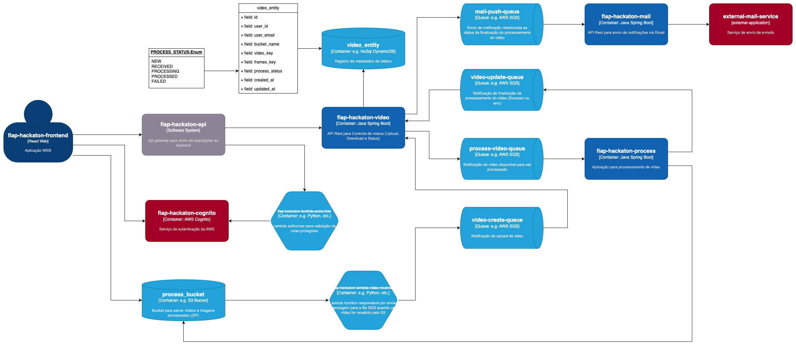
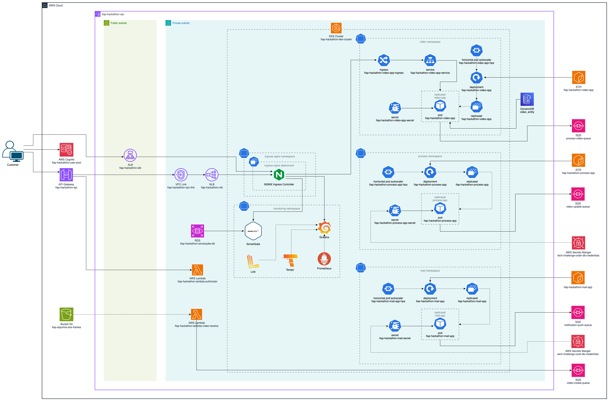

# 🎯 Pós Tech FIAP - Hackathon - Grupo 12

---

## 👥 Autores

Este projeto está sendo desenvolvido por:

- 👨‍💻 **Alexandre Miranda** – RM357321  
- 👨‍💻 **Diego Ceccon** – RM357437  
- 👩‍💻 **Jéssica Rodrigues** – RM357218  
- 👨‍💻 **Rodrigo Sartori** – RM358002  
- 👨‍💻 **Wilton Souza** – RM357991  

---

## ⚠️ Desafio

A empresa **FIAP X** contratou a equipe para melhorar um projeto de processamento de imagens. A versão atual recebe um vídeo, extrai imagens e gera um arquivo `.zip`. 

Essa versão foi apresentada para investidores, que aprovaram a ideia e agora desejam uma solução onde seja possível **enviar um vídeo pela aplicação e fazer o download do arquivo gerado**.

No entanto, o projeto original **não segue boas práticas de arquitetura**, e o desafio é reconstruí-lo com base nos conhecimentos adquiridos no curso, como:

- Organização e desenho de arquitetura
- Uso de microsserviços
- Qualidade de software
- Mensageria e filas
- Observabilidade
- Boa prática de infraestrutura como código

---

## 🎥 Vídeo de Apresentação

O vídeo inclui:
- Descrição completa do problema
- Arquitetura da solução
- Infraestrutura adotada
- Demonstração da aplicação funcionando

🔗 [Clique aqui para assistir no YouTube](https://youtu.be/PUwYsQpiJlc)

---

## 🗂️ Repositórios do Projeto

> Ordem de execução recomendada:

1. **[VPC](https://github.com/hackathon-fiap-soat-12/fiap-hackathon-vpc)** – Criação da VPC com Terraform  
2. **[BD](https://github.com/hackathon-fiap-soat-12/fiap-hackathon-db)** – Bancos de dados no RDS  
3. **[Queue](https://github.com/hackathon-fiap-soat-12/fiap-hackathon-queue)** – Filas via SQS  
4. **[K8S - Cluster](https://github.com/hackathon-fiap-soat-12/fiap-hackathon-k8s-cluster)** – Cluster Kubernetes  
5. **[K8S - Infra](https://github.com/hackathon-fiap-soat-12/fiap-hackathon-k8s-infra)** – Infraestrutura da aplicação  
6. **[Observability](https://github.com/hackathon-fiap-soat-12/fiap-hackathon-observability)** – Monitoramento e logs  
7. **[Mail](https://github.com/hackathon-fiap-soat-12/fiap-hackathon-mail)** – Envio de e-mails após o processamento (ECR incluso)
8. **[Process](https://github.com/hackathon-fiap-soat-12/fiap-hackathon-process)** – Processamento do vídeo (ECR incluso)  
9. **[Video API - Orquestrador](https://github.com/hackathon-fiap-soat-12/fiap-hackathon-video)** – Orquestrador principal da aplicação (ECR incluso)
10. **[Lambda Receive Video](https://github.com/hackathon-fiap-soat-12/fiap-hackathon-lambda-video-receive)** – Lambda responsável por receber o vídeo  
11. **[Lambda Authorizer](https://github.com/hackathon-fiap-soat-12/fiap-hackathon-lambda-authorizer)** – Lambda de autorização
12. **[Gateway](https://github.com/hackathon-fiap-soat-12/fiap-hackathon-api-gateway)** – API Gateway  
13. **[Cognito](https://github.com/hackathon-fiap-soat-12/fiap-hackathon-cognito)** – Autenticação via Cognito
14. **[Frontend - Alquimia Frames](https://github.com/hackathon-fiap-soat-12/fiap-hackathon-frontend)** – Interface gráfica do usuário (frontend)

## Diagrama C4 da solução

## Desenho da infraestrutura

